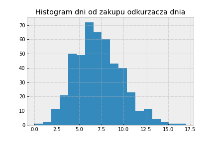
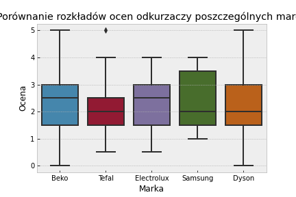

# Final paper
## Analiza zbioru danych 12_S╠üWIE╠ĘTOKRZYSKIE.csv
### Histogramy:

### Jaka jest mediana ocen każdej z marek odkurzaczy?

Można zauważyć, że najwyższe oceny pod względem mediany mają odkurzacze marki Electrolux oraz Beko, ale poza tym to generalnie są one całkiem pododbne. Użytecznym zatem będzie również sprawdzenie jak prezentuje się rozkład ocen dla każdej z marek odkurzaczy.

Jak można zauważyć Beko pomimo jednej z najwyższych median ocen ma dosyć szeroką rozpiętość ocen z lekkim przekrzywieniem w stronę tych słabszych ocen. Dla porównania Samsung jest mocniej przekrzywiony w stronę lepszych wartości ocen. Przyczyną takiego rozkładu ocen w przypadku odkurzaczy Beko, czy też Dyson może być pewna stronniczość klientów(ktoś nie lubi marki X zatem da jej słabą ocenę albo zaznaczy najwyższą ocenę aby system zbierania feedbacku się od niego ‘odczepił’). Do rzetelniejszej analizy potrzebne by były na pewno treści recenzji, a nie jedynie oceny danego produktu.

### Jak różnią się oceny odkurzaczy ze względu na wiek?

Współczynnik korelacji wieku kupującego i oceny odkurzaczy: -0.10152332751198487.
Można wskazać, że wraz z wiekiem odkurzacze oceniane są niżej. Świadczy o tym również współczynnik korelacji(co warto wspomnieć słabej). Analizę można rozszerzyć o sprawdzenie istnienia jakiejś nielinowej relacji między wiekiem kupującego, a oceną produktu. Z wykresu widać, że mediana ocen w poszczególnych grupach potrafi się różnić nawet o 1 stopień.

### Jak różnią się oceny odkurzaczy ze względu na płeć?

Można zaobserwować, że kobiety wyżej oceniały zakupione przez siebie odkurzacze w porównaniu do mężczyzn. Może być to spowodowane tym, że bardziej znają się na sprzęcie, którym na co dzień operują, zatem dokonywały trafniejszych zakupów. Możliwe, że wyżej oceniały zakupione odkurzacze, bo im ciężej przyznać się do błędu niż mężczyznom.